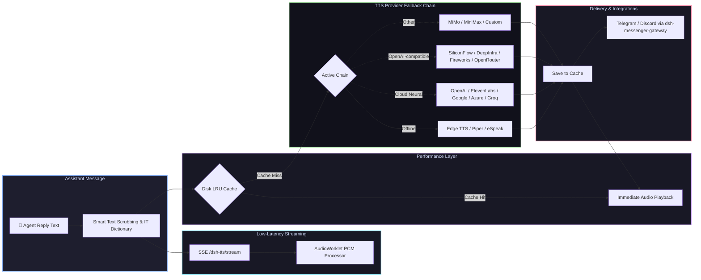

# 📦 @goodandready/dsh-tts

<div align="center">

<h3>Multi-Provider Text-to-Speech Voice Synthesis with Local Neural Engines, Sub-300ms Streaming, IT Dictionary & Messenger Integration for DeepSeek Harness</h3>

<p align="center">
  <a href="https://www.npmjs.com/package/@goodandready/dsh-tts"></a>
  <a href="LICENSE"></a>
  <a href="https://github.com/topics/dsh-plugin"></a>
  <a href="https://nodejs.org"></a>
</p>

<p align="center">
  <a href="https://goodandready.app/"></a>
</p>

<p align="center">
  <a href="README.md"><b>🇬🇧 English</b></a> •
  <a href="README.ru.md"><b>🇷🇺 Русский</b></a> •
  <a href="README.zh.md"><b>🇨🇳 中文说明</b></a>
</p>

<table align="center">
  <tr>
    <td align="center">
      ⭐ <strong>If you like this plugin, please star it on GitHub</strong> — it shows me that the plugin is useful to you and motivates me to keep developing it.
      <br><br>
      🐛 <strong>If you find a bug or would like to request a feature</strong>, open a GitHub issue in any language — I will review your proposal and implement useful suggestions in a future plugin version.
    </td>
  </tr>
</table>

</div>

---

## ⚡ Overview

**`dsh-tts`** provides robust, lifelike spoken voice synthesis for assistant replies in the **DeepSeek Harness** Web UI. When **Speak agent replies** is enabled, each finished assistant turn or real-time streaming chunk is synthesized on the host and streamed directly to the browser.

API keys never reach client browsers: synthesis is executed entirely on the host backend across **independent multi-provider fallback chains**, including local system engines (Edge TTS, Piper, eSpeak). Kokoro-82M and F5-TTS weights can be downloaded for future runtime support, but neural inference is **not bundled** in this package — those providers fail honestly and the chain continues.



---

## 🚀 Key Features

### 1. 📴 Offline system engines + optional future neural runtimes
* **Edge TTS / Piper / eSpeak**: fully offline or free local/system synthesis without cloud API keys (Edge needs the `edge-tts` CLI).
* **Kokoro-82M / F5-TTS**: weight download and status UI only. **Neural inference is not bundled** in this package — those providers fail with a clear reason and the fallback chain continues. Do not enable them expecting speech until a supported runtime is wired.
* **ModelManager UI**: Direct manual installation in settings with real-time download progress bar, SHA-256 validation, and deletion. No silent or automatic multi-gigabyte downloads.

### 2. ⚡ Real-Time Streaming Audio (< 300 ms Latency)
* **AudioWorklet (`TTSWorklet`)**: High-performance Web Audio Worklet processor playing seamless Float32Array PCM chunks at 24 kHz without audible clicks or buffer underruns.
* **Server-Sent Events (SSE)**: Dedicated `/dsh-tts/stream` route delivering synthesized chunks to connected browsers instantly.

### 3. 🎙️ Voice Duplex & VAD Barge-In (with `@goodandready/dsh-voice`)
* **Full-Duplex Conversation**: Automatic voice reply synthesis upon completion of speech dictation.
* **VAD Barge-In**: Immediately mutes assistant speech playback when user voice activity is detected.
* **Installation Guard**: If `@goodandready/dsh-voice` is not present, settings controls are disabled with an explicit instruction banner (`dsh plugin --profile web add @goodandready/dsh-voice`).

### 4. 📚 Built-in IT Terminology Pronunciation Dictionary
* **Pre-configured Lexicon**: Correct phonetic pronunciation for common technical abbreviations and developer terms:
  - `SQL` $\rightarrow$ "сиквел"
  - `Nginx` $\rightarrow$ "энджинкс"
  - `Kubernetes` / `K8s` $\rightarrow$ "кубернетис"
  - `Docker` $\rightarrow$ "докер", `API` $\rightarrow$ "апи", `JSON` $\rightarrow$ "джейсон", `YAML` $\rightarrow$ "ямл"
  - `GUI`, `CLI`, `CI/CD`, `PR`, `Regex`, `OAuth`, `HTTP`, `HTTPS`, `CPU`, `GPU`, `RAM`
* **Interactive UI Editor**: Edit rules, preview phonetic substitutions with the **▶ Listen** button, and populate standard IT terms with one click.

### 5. 👥 Multi-Agent Personas & Subagent Voice Overrides
* Assign distinct voices, providers, models, and audio chimes to individual subagents (e.g. `coder`, `reviewer`, `planner`, `tester`).
* **Subagent Auto-Detection**: With `autoDetectSubagent` enabled, incoming turns automatically match subagents by message metadata (`subagent`, `agent`, `author`, `name`) and dynamically apply voice, rate, and SSML style presets.

### 6. 💾 Audio Clip Export & Speech History
* Export any spoken utterance directly to an audio file (`.wav` / `.mp3`) via `exportAudioClip(text)`.
* Instant download buttons (`⤓`) integrated directly into the input dock speaker control and recent utterances dropdown list.

### 7. 💬 Messenger Voice Notes Integration (with `@goodandready/dsh-messenger-gateway`)
* Generates voice audio for Telegram and Discord bot replies via `POST /dsh-tts/speak`.
* Protective dependency check with installation hint when gateway plugin is missing.

### 8. 🌐 Canonical English & Chinese Localization (EN + ZH)
* Complete built-in English (`en`) and Chinese (`zh`) UI and speech template dictionaries.
* Centralized Russian localization provided via `@goodandready/dsh-russian-lang` through Gitea issue tracking.
* Smart boundary tokenizer supporting CJK full-width punctuation (`。！？`), abbreviations, file extensions, and IP/version numbers.

---

## 🛠️ Complete Supported Providers Matrix (18 Backends)

| Provider Key | Service Backend | Default Model | Default Voice | Credential Ref | Features & Notes |
|---|---|---|---|---|---|
| `kokoro` | Local Kokoro-82M ONNX | `hexgrad/Kokoro-82M` | `af_bella` | *None* | Weights downloadable; **ONNX inference not bundled** — fails honestly |
| `f5` | Local F5-TTS GPU Daemon | `F5-TTS` | Default | *None* | Daemon ping only; **GPU inference not bundled** — fails honestly |
| `elevenlabs` | ElevenLabs API | `eleven_multilingual_v2` | `Rachel` | `ELEVENLABS_API_KEY` | Ultra-realistic, emotional nuance |
| `openai` | OpenAI Audio | `gpt-4o-mini-tts` / `tts-1` | `alloy` | `OPENAI_API_KEY` | High-quality industry standard |
| `edge` | Microsoft Edge Online | `ru-RU-SvetlanaNeural` | `ru-RU-SvetlanaNeural` | *None* | **Free, high-fidelity neural TTS without API keys** |
| `siliconflow` | SiliconFlow CosyVoice | `FunAudioLLM/CosyVoice2-0.5B` | Default | `SILICONFLOW_API_KEY` | State-of-the-art CosyVoice2 neural engine |
| `deepinfra` | DeepInfra Kokoro | `hexgrad/Kokoro-82M` | Default | `DEEPINFRA_API_KEY` | Fast open-weights Kokoro synthesis |
| `fireworks` | Fireworks AI | `kokoro` | Default | `FIREWORKS_API_KEY` | Ultra-low latency Kokoro inference |
| `minimax` | MiniMax Speech | `speech-01-turbo` | Default | `MINIMAX_API_KEY` | High-expressiveness neural voice |
| `mimo` | Xiaomi MiMo Audio | `mimo-v2.5-tts` | Default | `MIMO_API_KEY` | Low-latency streaming TTS |
| `google` | Google Cloud TTS | `gemini-2.5-flash-preview-tts` | Language default | `GEMINI_API_KEY` | Multilingual Google Gemini voice synthesis |
| `azure` | Azure Cognitive Speech | `en-US-JennyNeural` | Region default | `AZURE_SPEECH_KEY` | Enterprise neural synthesis |
| `deepgram` | Deepgram Aura | `aura-asteria-en` | `asteria` | `DEEPGRAM_API_KEY` | Ultra-low latency voice output |
| `groq` | Groq TTS | `playai-tts` | `default` | `GROQ_API_KEY` | Near-instant inference speed |
| `openrouter` | OpenRouter Audio | `openai/gpt-4o-mini-tts` | `alloy` | `OPENROUTER_API_KEY` | Unified router access |
| `custom` | Custom OpenAI-compatible | Configurable | Configurable | `CUSTOM_TTS_API_KEY` | Any `/v1/audio/speech` endpoint |
| `piper` | Local Piper ONNX | Local ONNX weights | Model default | *None* | 100% offline neural engine |
| `espeak` | Local eSpeak NG | System synth | `ru` / `en` | *None* | 100% offline lightweight fallback |

---

## 🧹 Smart Text Scrubbing & Formatting Engine

Before text reaches speech synthesizers, `dsh-tts` intelligently sanitizes and filters the message so the assistant doesn't read out syntax noise:
* **Fenced Code Blocks**: Spoken as *"code block, N lines"* / *"блок кода, N строк"*.
* **Markdown Tables**: Spoken as *"table, N rows"* / *"таблица, N строк"*.
* **Summary Intros**: Spoken as *"Summary of the reply"* / *"Пересказ ответа"*.
* **Narration Filters**: Skip asterisk actions (`*smiles*`), narrate quotes only, and apply custom regex removal.

---

## 📦 Quick Installation

```bash
dsh plugin --profile web add @goodandready/dsh-tts
```

> [!IMPORTANT]
> Restart DSH Web UI after installation (`systemctl --user restart dsh-web`) and refresh your browser tab.

---

## ⚙️ Configuration Recipes (`settings.yaml`)

```yaml
dsh-tts:
  speakReplies: true
  enableLocalEngines: true
  kokoroEnabled: true
  streamingEnabled: true
  enableItDictionary: true
  voiceDuplexEnabled: true
  vadBargeIn: true
  messengerTtsEnabled: true
  cache: true
  cacheMaxMb: 150
  autoDetect: true
  chain:
    - provider: edge
    - provider: espeak
      voice: ru-RU-SvetlanaNeural
    - provider: openai
      model: tts-1
      voice: alloy
  roles:
    coder:
      provider: openai
      voice: onyx
    reviewer:
      provider: edge
      voice: ru-RU-DmitryNeural
```

---

### Settings UI coverage

The plugin settings card (**Settings → Plugins → Plugin settings**) exposes every user-facing schema field, including an **Advanced** block for `maxChars`, `sentenceChars`, `timeoutMs`, `maxQueue`, `openaiBaseUrl`, `mimoBaseUrl`, `mimoFormat`, and `minimaxBin`.

Provider **API keys are never stored in plugin settings**. Paste them in the chain editor; values go to the DSH credential store via `PUT /dsh-tts/credential`.

Config-only (not in the card): `*KeyEnv` fields (`openaiKeyEnv`, `elevenlabsKeyEnv`, …). They only rename the credential slot the plugin looks up. Change them in `settings.yaml` if you must rebind a key name; the defaults match the usual environment variable names.


## 🤖 HTTP Endpoints Reference

* `GET /dsh-tts/stream` — Real-time Server-Sent Events (SSE) audio streaming.
* `POST /dsh-tts/speak` — `{ text, voice?, model? }` → Returns synthesized audio.
* `POST /dsh-tts/preview` — `{ provider, model, voice, text? }` → Test voice playback in UI.
* `GET /dsh-tts/models/status` — Reports Kokoro/F5 weight installation states (download only; inference not bundled).
* `POST /dsh-tts/models/install` — `{ engine: 'kokoro' | 'f5' }` → Starts HuggingFace model download.
* `DELETE /dsh-tts/models/delete` — `{ engine: 'kokoro' | 'f5' }` → Removes local model files.
* `GET /dsh-tts/integrations` — Status of sibling plugins (`dsh-voice`, `dsh-messenger-gateway`).
* `GET /dsh-tts/status` — Returns active chain state, cache statistics, and engine readiness.

---

## 📄 License

MIT © [GooDAnDReaDY](https://github.com/GooDAnDReaDY)
