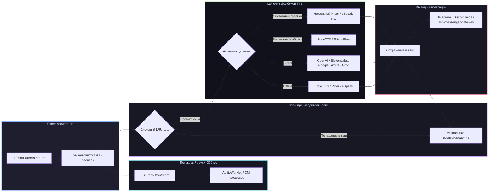

# 📦 @goodandready/dsh-tts

<div align="center">

<h3>Многопровайдерная озвучка ответов агента: облачные и системные offline-движки, потоковый звук, IT-словарь и интеграция с мессенджерами для DeepSeek Harness</h3>

<p align="center">
  <a href="https://www.npmjs.com/package/@goodandready/dsh-tts"></a>
  <a href="LICENSE"></a>
  <a href="https://github.com/topics/dsh-plugin"></a>
  <a href="https://nodejs.org"></a>
</p>

<p align="center">
  <a href="https://goodandready.app/"></a>
</p>

<p align="center">
  <a href="README.md"><b>🇬🇧 English</b></a> •
  <a href="README.ru.md"><b>🇷🇺 Русский</b></a> •
  <a href="README.zh.md"><b>🇨🇳 中文说明</b></a>
</p>

<table align="center">
  <tr>
    <td align="center">
      ⭐ <strong>Если вам нравится этот плагин, поставьте ему звезду на GitHub</strong> — это покажет мне, что плагин вам полезен, и будет мотивировать меня развивать его дальше.
      <br><br>
      🐛 <strong>Если вы нашли баг или хотите предложить новый функционал</strong>, создайте issue на GitHub на любом языке — я рассмотрю ваше предложение и реализую полезные идеи в одной из следующих версий плагина.
    </td>
  </tr>
</table>

</div>

---

## ⚡ Обзор

> **Честно про локальные нейросети:** Kokoro/F5 — только статус и загрузка весов. Inference **не входит** в пакет; эти провайдеры падают с понятной причиной, цепочка идёт дальше. Рабочий offline: Edge TTS, Piper, eSpeak.

**`dsh-tts`** обеспечивает качественное голосовое озвучивание ответов ассистента в веб-интерфейсе **DeepSeek Harness**. При включённой опции **«Читать ответы агента»**, каждая готовая реплика или потоковый фрагмент синтезируется на хосте и мгновенно воспроизводится в браузере.

API-ключи никогда не передаются в браузер: синтез аудио выполняется на стороне хоста через **независимые цепочки отказоустойчивости (фолбеков)**, включая системные offline-движки (Edge TTS, Piper, eSpeak). Kokoro/F5 — только загрузка весов; inference не входит в пакет.



---

## 🚀 Ключевые возможности

### 1. 📴 Offline-системные движки и честный статус нейросетей
* **Edge TTS / Piper / eSpeak**: рабочий offline/системный синтез без облачных API-ключей.
* **Kokoro-82M / F5-TTS**: только UI и загрузка весов. **Inference не входит в пакет** — провайдер падает с понятной причиной, цепочка идёт дальше.
* **ModelManager в UI**: Ручная загрузка моделей прямо из настроек плагина с отображением процентов и прогресс-бара, проверкой SHA-256 и кнопкой удаления. Никаких скрытых или автозагрузок гигабайтных весов.

### 2. ⚡ Потоковое воспроизведение звука с задержкой < 300 мс
* **AudioWorklet (`TTSWorklet`)**: Высокопроизводительный процессор веб-аудио с бесшовным кольцевым буфером для воспроизведения PCM-чанков (24 кГц) без щелчков и пауз.
* **Server-Sent Events (SSE)**: Роут `/dsh-tts/stream` передаёт синтезированные куски речи сразу в браузер, исключая задержки традиционного полинга.

### 3. 🎙️ Голосовой диалог и VAD Barge-In (в связке с `@goodandready/dsh-voice`)
* **Voice-to-Voice дуплекс**: Автоматический запуск озвучки ответа сразу после завершения голосовой диктовки.
* **VAD Barge-In**: Мгновенное глушение речи ассистента, как только пользователь начинает говорить в микрофон.
* **Защитная блокировка**: Если плагин `@goodandready/dsh-voice` не установлен, переключатели блокируются (`disabled`), а в интерфейсе отображается подсказка: `dsh plugin --profile web add @goodandready/dsh-voice`.

### 4. 📚 Предустановленный словарь IT-произношения
* **Корректная транскрипция терминов**: Автоматическая замена аббревиатур и названий:
  - `SQL` $\rightarrow$ «сиквел»
  - `Nginx` $\rightarrow$ «энджинкс»
  - `Kubernetes` / `K8s` $\rightarrow$ «кубернетис»
  - `Docker` $\rightarrow$ «докер», `API` $\rightarrow$ «апи», `JSON` $\rightarrow$ «джейсон», `YAML` $\rightarrow$ «ямл»
  - `GUI`, `CLI`, `CI/CD`, `PR`, `Regex`, `OAuth`, `HTTP`, `HTTPS`, `CPU`, `GPU`, `RAM`
* **Интерактивный редактор в UI**: Правка правил, кнопка **«▶ Прослушать»** для каждого слова и кнопка **«Вставить IT-термины в таблицу»** в один клик.

### 5. 👥 Персонализация голосов субагентов (Multi-Agent Personas)
* Назначение индивидуального голоса, провайдера, модели и сигнала (chime) для каждого субагента (`coder`, `reviewer`, `planner`, `tester` и др.).
* Автоматический перехват имени агента из событий сессии (`session.agent` или `event.data.agent`).

### 6. 💬 Голосовые сообщения в мессенджеры (`@goodandready/dsh-messenger-gateway`)
* Озвучивание ответов и отправка войсов в Telegram и Discord через роут `POST /dsh-tts/speak`.
* Защитная проверка наличия плагина-шлюза с подсказкой по установке.

---

## 🛠️ Матрица поддерживаемых провайдеров (18 бэкендов)

| Ключ провайдера | Сервис | Модель по умолчанию | Голос по умолчанию | Имя ключа (credential) | Особенности |
|---|---|---|---|---|---|
| `kokoro` | Веса Kokoro-82M (ONNX) | `hexgrad/Kokoro-82M` | `af_bella` | *Не требуется* | Веса скачать можно; **inference не bundled** — честный fail |
| `f5` | Демон F5 (ping) | `F5-TTS` | По умолчанию | *Не требуется* | Только ping; **GPU inference не bundled** — честный fail |
| `elevenlabs` | ElevenLabs API | `eleven_multilingual_v2` | `Rachel` | `ELEVENLABS_API_KEY` | Реалистичный эмоциональный синтез |
| `openai` | OpenAI Audio | `gpt-4o-mini-tts` / `tts-1` | `alloy` | `OPENAI_API_KEY` | Эталонное качество индустрии |
| `edge` | Microsoft Edge Online | `ru-RU-SvetlanaNeural` | `ru-RU-SvetlanaNeural` | *Не требуется* | **Бесплатный нейросинтез без API-ключей** |
| `siliconflow` | SiliconFlow CosyVoice | `FunAudioLLM/CosyVoice2-0.5B` | По умолчанию | `SILICONFLOW_API_KEY` | Нейродвижок CosyVoice2 |
| `deepinfra` | DeepInfra Kokoro | `hexgrad/Kokoro-82M` | По умолчанию | `DEEPINFRA_API_KEY` | Быстрый Kokoro в облаке |
| `fireworks` | Fireworks AI | `kokoro` | По умолчанию | `FIREWORKS_API_KEY` | Минимальная задержка инференса |
| `minimax` | MiniMax Speech | `speech-01-turbo` | По умолчанию | `MINIMAX_API_KEY` | Выразительный эмоциональный голос |
| `mimo` | Xiaomi MiMo Audio | `mimo-v2.5-tts` | По умолчанию | `MIMO_API_KEY` | Потоковый синтез речи |
| `google` | Google Cloud TTS | `gemini-2.5-flash-preview-tts` | По умолчанию | `GEMINI_API_KEY` | Многоязычный Gemini TTS |
| `azure` | Azure Cognitive Speech | `en-US-JennyNeural` | По умолчанию | `AZURE_SPEECH_KEY` | Корпоративный нейросинтез |
| `deepgram` | Deepgram Aura | `aura-asteria-en` | `asteria` | `DEEPGRAM_API_KEY` | Сверхнизкая задержка ответа |
| `groq` | Groq TTS | `playai-tts` | `default` | `GROQ_API_KEY` | Мгновенная генерация |
| `openrouter` | OpenRouter Audio | `openai/gpt-4o-mini-tts` | `alloy` | `OPENROUTER_API_KEY` | Доступ через единый роутер |
| `custom` | OpenAI-совместимый API | Настраивается | Настраивается | `CUSTOM_TTS_API_KEY` | Любой эндпоинт `/v1/audio/speech` |
| `piper` | Локальный Piper ONNX | Локальные веса | По умолчанию | *Не требуется* | Полностью оффлайн движок |
| `espeak` | Локальный eSpeak NG | Системный | `ru` / `en` | *Не требуется* | Легковесный системный синтезатор |

---

## 📦 Быстрая установка

```bash
dsh plugin --profile web add @goodandready/dsh-tts
```

> [!IMPORTANT]
> После установки перезапустите Web UI (`systemctl --user restart dsh-web`) и обновите вкладку браузера.

---

## ⚙️ Пример конфигурации (`settings.yaml`)

```yaml
dsh-tts:
  speakReplies: true
  enableLocalEngines: true
  kokoroEnabled: true
  streamingEnabled: true
  enableItDictionary: true
  voiceDuplexEnabled: true
  vadBargeIn: true
  messengerTtsEnabled: true
  cache: true
  cacheMaxMb: 150
  autoDetect: true
  chain:
    - provider: kokoro
    - provider: edge
      voice: ru-RU-SvetlanaNeural
    - provider: openai
      model: tts-1
      voice: alloy
  roles:
    coder:
      provider: openai
      voice: onyx
    reviewer:
      provider: edge
      voice: ru-RU-DmitryNeural
```

---

### Покрытие настроек в UI

Карточка плагина (**Настройки → Плагины → Настройки плагинов**) показывает все пользовательские поля схемы, включая блок **Дополнительно**: `maxChars`, `sentenceChars`, `timeoutMs`, `maxQueue`, `openaiBaseUrl`, `mimoBaseUrl`, `mimoFormat`, `minimaxBin`.

**API-ключи не хранятся в настройках плагина.** Вставляйте их в редакторе цепочки — значение уходит в credential store DSH через `PUT /dsh-tts/credential`.

Только в конфиге (нет в карточке): поля `*KeyEnv` (`openaiKeyEnv`, `elevenlabsKeyEnv`, …). Они задают **имя** credential-слота; по умолчанию совпадают с привычными именами env-переменных. Меняйте в `settings.yaml`, если нужно перевязать имя ключа.


## 🤖 HTTP роуты API

* `GET /dsh-tts/stream` — Потоковая передача аудио по SSE в реальном времени.
* `POST /dsh-tts/speak` — `{ text, voice?, model? }` → Возвращает аудиофайл для воспроизведения.
* `POST /dsh-tts/preview` — `{ provider, model, voice, text? }` → Тестовое прослушивание голоса в UI.
* `GET /dsh-tts/models/status` — Статус загрузки весов Kokoro/F5 (inference не в комплекте).
* `POST /dsh-tts/models/install` — `{ engine: 'kokoro' | 'f5' }` → Запуск загрузки модели с HuggingFace.
* `DELETE /dsh-tts/models/delete` — `{ engine: 'kokoro' | 'f5' }` → Удаление локальной модели.
* `GET /dsh-tts/integrations` — Проверка статуса связанных плагинов (`dsh-voice`, `dsh-messenger-gateway`).
* `GET /dsh-tts/status` — Общий статус цепочки, статистика кэша и готовность движков.

---

## 📄 Лицензия

MIT © [GooDAnDReaDY](https://github.com/GooDAnDReaDY)
