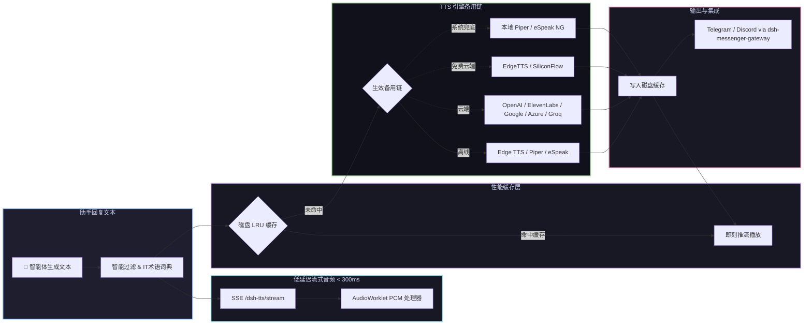

# 📦 @goodandready/dsh-tts

<div align="center">

<h3>DeepSeek Harness 多引擎语音合成：云端与系统离线引擎、流式音频、IT 术语词典与即时通讯集成</h3>

<p align="center">
  <a href="https://www.npmjs.com/package/@goodandready/dsh-tts"></a>
  <a href="LICENSE"></a>
  <a href="https://github.com/topics/dsh-plugin"></a>
  <a href="https://nodejs.org"></a>
</p>

<p align="center">
  <a href="https://goodandready.app/"></a>
</p>

<p align="center">
  <a href="README.md"><b>🇬🇧 English</b></a> •
  <a href="README.ru.md"><b>🇷🇺 Русский</b></a> •
  <a href="README.zh.md"><b>🇨🇳 中文说明</b></a>
</p>

<table align="center">
  <tr>
    <td align="center">
      ⭐ <strong>如果您喜欢这个插件，请在 GitHub 上为它点亮 Star</strong> — 这能让我知道插件对您有用，并鼓励我继续开发和维护它。
      <br><br>
      🐛 <strong>如果您发现 Bug 或希望增加功能</strong>，请使用任意语言在 GitHub 上提交 Issue — 我会评估您的建议，并在后续版本中实现有价值的改进。
    </td>
  </tr>
</table>

</div>

---

## ⚡ 插件概览

**`dsh-tts`** 为 **DeepSeek Harness** Web 界面提供高保真智能体回复语音朗读服务。开启 **朗读智能体回复** 后，每条生成的助手回复或实时流式片段均由服务端合成并即时推流至浏览器播放。

API 密钥绝不暴露给前端：音频合成全程在服务端通过**多服务商独立备用链**执行，包括系统离线引擎（Edge TTS、Piper、eSpeak）。Kokoro/F5 仅可下载权重，**推理未捆绑**。



---

## 🚀 核心功能

### 1. 📴 离线系统引擎与诚实的神经引擎状态
* **Edge TTS / Piper / eSpeak**：可用的离线/系统合成，无需云 API Key。
* **Kokoro-82M / F5-TTS**：仅权重下载与状态展示。**推理未捆绑在本包中**，provider 会明确失败并继续 fallback。
* **ModelManager 管理界面**：在设置中手动安装模型，实时显示下载进度条、SHA-256 校验和一键删除。无任何静默或自动下载。

### 2. ⚡ 实时流式音频播放（延迟 < 300ms）
* **AudioWorklet (`TTSWorklet`)**：高性能 Web Audio Worklet 处理器，以 24kHz 采样率无缝播放 Float32Array PCM 数据块，无可感知的爆音或缓冲区欠载。
* **Server-Sent Events (SSE)**：专用 `/dsh-tts/stream` 路由将合成音频片段即时推送至浏览器。

### 3. 🎙️ 语音双工对话与 VAD 打断（配合 `@goodandready/dsh-voice`）
* **全双工对话**：语音听写完成后自动启动回复语音合成。
* **VAD 打断**：检测到用户开始说话时立即静音助手语音播放。
* **安装保护**：若未安装 `@goodandready/dsh-voice`，相关控件将禁用并显示安装指引。

### 4. 📚 内置 IT 术语发音词典
* **预配置词汇表**：为常见技术缩写和开发者术语提供正确语音替换（SQL、Nginx、Kubernetes/K8s、Docker、API、JSON、YAML、GUI、CLI、CI/CD 等 25 个术语）。
* **交互式编辑器**：编辑规则，逐条点击 **▶ 试听** 按钮预听效果，一键加载全部 IT 术语。

### 5. 👥 多智能体角色个性化语音与自动识别
* 为不同子智能体（`coder`、`reviewer`、`planner`、`tester` 等）分配独立的语音、服务商、模型、提示音与 SSML 风格。
* **智能体自动识别**：开启 `autoDetectSubagent` 后，自动根据消息元数据（`subagent`、`agent`、`author`、`name`）匹配对应的专属音色与语速。

### 6. 💾 音频片段导出与历史回放
* 任意朗读过的回复均可通过 `exportAudioClip(text)` 导出为标准音频文件（`.wav` / `.mp3`）。
* 输入框控制栏及最近朗读列表中内置即时下载按钮（`⤓`）。

### 7. 💬 即时通讯语音消息集成（配合 `@goodandready/dsh-messenger-gateway`）
* 通过 `POST /dsh-tts/speak` 为 Telegram 和 Discord 机器人回复生成语音消息。
* 缺少网关插件时自动显示安装提示，防护性依赖检查。

### 8. 🌐 深度中文本土化支持与智能断句分词器
* 完整内置英文 (`en`) 与中文 (`zh`) 双语界面及全量语音模版。
* 针对 CJK 中文全角标点（`。！？`）与自适应分词长度特别优化，避免长句卡顿。
* 保护缩写、文件名（`package.json`）、网址域名（`goodandready.app`）及 IP / 版本号不被误切。

---

## 🛠️ 支持的 18 大服务商矩阵

| 服务商 Key | 对应引擎 | 默认模型 | 默认发音人 | 凭证变量名 | 说明与亮点 |
|---|---|---|---|---|---|
| `kokoro` | Kokoro 权重（ONNX） | `hexgrad/Kokoro-82M` | `af_bella` | *无需密钥* | 可下载权重；**推理未捆绑** — 明确失败 |
| `f5` | F5 守护进程（ping） | `F5-TTS` | 默认 | *无需密钥* | 仅 ping；**GPU 推理未捆绑** — 明确失败 |
| `elevenlabs` | ElevenLabs API | `eleven_multilingual_v2` | `Rachel` | `ELEVENLABS_API_KEY` | 极致拟人情感音色 |
| `openai` | OpenAI Audio | `gpt-4o-mini-tts` / `tts-1` | `alloy` | `OPENAI_API_KEY` | 经典高清发音 |
| `edge` | 微软 Edge 在线 | `zh-CN-XiaoxiaoNeural` | `zh-CN-XiaoxiaoNeural` | *无需密钥* | **免费免 Key 高保真神经网络语音** |
| `siliconflow` | 硅基流动 CosyVoice | `FunAudioLLM/CosyVoice2-0.5B` | 默认 | `SILICONFLOW_API_KEY` | SOTA CosyVoice2 语音大模型 |
| `deepinfra` | DeepInfra Kokoro | `hexgrad/Kokoro-82M` | 默认 | `DEEPINFRA_API_KEY` | 极速轻量 Kokoro 开源引擎 |
| `fireworks` | Fireworks AI | `kokoro` | 默认 | `FIREWORKS_API_KEY` | 毫秒级 Kokoro 推理 |
| `minimax` | MiniMax Speech | `speech-01-turbo` | 默认 | `MINIMAX_API_KEY` | 高表现力中文旗舰发音 |
| `mimo` | 小米 MiMo Audio | `mimo-v2.5-tts` | 默认 | `MIMO_API_KEY` | 低延迟流式语音 |
| `google` | Google Cloud TTS | `gemini-2.5-flash-preview-tts` | 语种默认 | `GEMINI_API_KEY` | 谷歌 Gemini 多语种神经网络合成 |
| `azure` | Azure 认知语音 | `en-US-JennyNeural` | 区域默认 | `AZURE_SPEECH_KEY` | 企业级神经网络发音人 |
| `deepgram` | Deepgram Aura | `aura-asteria-en` | `asteria` | `DEEPGRAM_API_KEY` | 极低延迟英文输出 |
| `groq` | Groq TTS | `playai-tts` | `default` | `GROQ_API_KEY` | 极速推理 |
| `openrouter` | OpenRouter Audio | `openai/gpt-4o-mini-tts` | `alloy` | `OPENROUTER_API_KEY` | 统一路由器通道 |
| `custom` | 自定义 OpenAI 规范 | 可配置 | 可配置 | `CUSTOM_TTS_API_KEY` | 任意兼容 `/v1/audio/speech` 接口 |
| `piper` | 本地 Piper ONNX | 本地权重 | 模型默认 | *无需密钥* | 100% 离线神经网络引擎 |
| `espeak` | 本地 eSpeak NG | 系统合成器 | `zh` / `en` | *无需密钥* | 100% 离线轻量兜底 |

---

## 📦 安装指南

```bash
dsh plugin --profile web add @goodandready/dsh-tts
```

> [!IMPORTANT]
> 安装后请重启 Web UI（`systemctl --user restart dsh-web`）并刷新浏览器标签页。

---

### 设置界面覆盖

插件设置卡片（**设置 → 插件 → 插件设置**）展示全部用户向 schema 字段，并含 **Advanced** 区：`maxChars`、`sentenceChars`、`timeoutMs`、`maxQueue`、`openaiBaseUrl`、`mimoBaseUrl`、`mimoFormat`、`minimaxBin`。

API 密钥不写入插件设置，只在链编辑器粘贴，经 `PUT /dsh-tts/credential` 写入 DSH credential store。


## ⚙️ 配置示例（`settings.yaml`）

```yaml
dsh-tts:
  speakReplies: true
  enableLocalEngines: true
  kokoroEnabled: true
  streamingEnabled: true
  enableItDictionary: true
  voiceDuplexEnabled: true
  vadBargeIn: true
  messengerTtsEnabled: true
  cache: true
  cacheMaxMb: 150
  autoDetect: true
  chain:
    - provider: kokoro
    - provider: edge
      voice: zh-CN-XiaoxiaoNeural
    - provider: openai
      model: tts-1
      voice: alloy
  roles:
    coder:
      provider: openai
      voice: onyx
    reviewer:
      provider: edge
      voice: zh-CN-YunxiNeural
```

---

## 🤖 HTTP API 路由

* `GET /dsh-tts/stream` — 实时 SSE 音频流推送。
* `POST /dsh-tts/speak` — `{ text, voice?, model? }` → 返回合成音频。
* `POST /dsh-tts/preview` — `{ provider, model, voice, text? }` → UI 中试听语音。
* `GET /dsh-tts/models/status` — 查询 Kokoro/F5 权重下载状态（推理未捆绑）。
* `POST /dsh-tts/models/install` — `{ engine: 'kokoro' | 'f5' }` → 启动模型下载。
* `DELETE /dsh-tts/models/delete` — `{ engine: 'kokoro' | 'f5' }` → 删除本地模型。
* `GET /dsh-tts/integrations` — 查询关联插件状态（`dsh-voice`、`dsh-messenger-gateway`）。
* `GET /dsh-tts/status` — 返回引擎链状态、缓存统计与引擎就绪信息。

---

## 📄 开源协议

MIT © [GooDAnDReaDY](https://github.com/GooDAnDReaDY)
